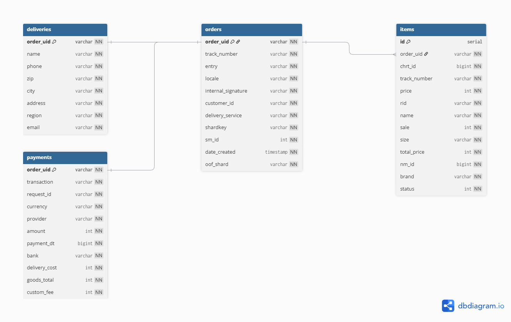
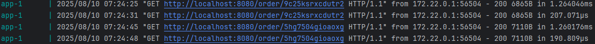

# Пояснения к тому, почему я сделал так, а не иначе
## База данных
Был вариант разместить по payment и delivery в той же таблице orders (провести нормализацию).
Но раз в примере разделены, то я тоже разделил.

Еще был вариант хранить эти данные в JsonB поле, если по ним не нужно будет проводить какие-то операции на уровне SQL,
но так как нет конкретики - выбрал классику.

Для миграций выбрал вроде бы стандартный инструмент.

Я знаю, что в проде нельзя писать пароли от базы в файлы, которые идут в git, но здесь оставил так для упрощения проверки решения.

Сама схема данных:

### Сравнение скорости получения данных с кэшем и без кэша (для этого примера кэш не грел, а только заполнял по запросам).
В таблице orders 25к записей.

С прогретым кэшем при попадании в кэш сразу быстрый ответ. Для прогрева поставил 1000 записей по последним date_created
и индекс на date_created чтобы быстрее сортировать.

### Про фронтенд
Вообще фронтенд нужно раздавать через веб-сервер, например, nginx. Тут для упрощения оставил через go-приложение.
Документация так-то тоже статика и ее тоже нужно раздавать так (а на релизе не раздавать скорее всего).
